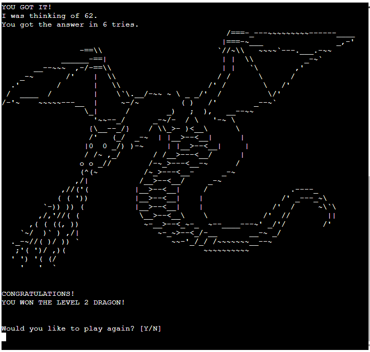
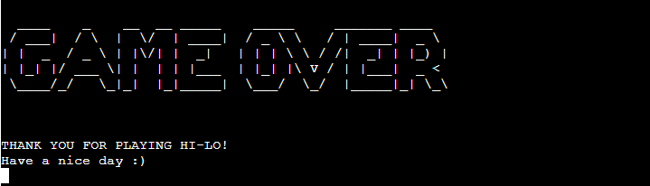

# __HI - LO__

## Welcome to HI - LO!

> __A text-based number-guessing game in true 80's retro style.__

* A number will be randomly generated depending on the chosen difficulty level.
* The goal is to guess the number in as few tries as possible, with the help
  of 'higher-than' and 'lower-than' hints.
* If the player manages to guess the correct number in few enough tries they
  will be rewarded with some classic ASCII-art.

> Try out the deployed game [__HERE__](https://hi-lo-mv.herokuapp.com/)   
> The game is best viewed in a resolution that will allow you to see the entire terminal-box.

---

## __The Game__

### __Starting Up__
* When the player first runs the program they are greeted with an ASCII-style game title,   
  followed by an explanation of the game rules.
* The player can then choose between 3 difficulty levels:
  - Easy: The game will pick a number between 1 - 10.
  - Normal: 1 - 100
  - Hard: 1 - 1000
* The game will not accept any other answer than 1, 2 or 3.
* The player also gets informed that they can end the game at any point by entering "E".
  - The game will accept both "e" and "E"

### __Gameplay__
* After a game mode has been selected, a number will be randomly generated within the chosen range.
* The player can now start guessing what the correct number is.
* After each guess the game will announce that their number is either higher or lower than the guessed number.
* The game will keep looping until a correct answer is given, or when the player gives up.
* After every 10'th incorrect guess the player will be asked if they wish to continue.
* When 30 incorrect guesses has been made, the game will terminate.

### __Bad Guesses__
* Only numbers in the chosen range will be accepted as a valid guess.
* The game also remembers what numbers has already been guessed on, and won't accept duplicate guesses.
* If an unacceptable guess has been entered, the game will respond with cheeky comments.

### __Winning__
* When the correct number has been found the player gets congratulated, and is informed of how many times they guessed.
* If the guesses are few enough, (3 on Easy, 6 on Normal and 10 on Hard) the player is rewarded with an ASCII-art dragon.
* Each difficulty level has a different image.
* The player then gets asked if they wish to play again.
  - The game will accept y, Y, yes, Yes, YES, n, N, no, No and NO.

### __The End__
* When the game is over, the player is informed of this in the true old-school way.

### __Easter Eggs & Cheat Codes__
* Any text-based game worth it's name needs to have easter eggs and cheats implemented.   
* So does this one.
* First, if you manage to guess the number correctly on the first try on hard mode, you will be rewarded with a unique dragon-picture that you wouldn't be able to access in any other way.
* Try to enter "Drag0n" or "I am a cheater" insted of guessing a number and see what happens.

---

## __Flowchart__

---

## __Technologies & Deployment__

* The game was designed and written in __GitPod__ using __Python__.
* The random and os modules were imported to randomise the number to be guessed, and to clear the screen when needed.
* The ASCII-text was created with [__this generator__](https://patorjk.com/software/taag/#p=display&f=Graffiti&t=Type%20Something%20)
* The __HTML__ and __CSS__ comes from a template provided by [__Code Institute__](https://codeinstitute.net/)
  - I have altered the HTML a bit by adding some extra rows to the mock terminal, so it could accommodate the ASCII-art.
* The code was pushed to a repository on [__GitHub__](https://github.com/MadMaddie81/hi-lo)
* The project was then deployed to [__Heroku__](https://heroku.com/) using the repo's main branch.
  - Config Var:
    * PORT : 8000
  - Buildpacks:
    * Python
    * NodeJS

---

## __Testing & Bugs__

> __Test results from the Code Institute [Python Linter](https://pep8ci.herokuapp.com/):__
>
> 

__The game has been continuously tested during the coding process, both in the GitPod terminal and in the mock terminal of the deployed project.__

### __Bugs Found & Resolved:__
* I screened the user input guess for integers, sorting out ValueErrors, which made it possible to guess numbers outside the scope of the chosen difficulty level.
  - __Resolved:__ I added more limitations to the input validator, making sure that only numbers in the correct range was accepted as a valid guess.
* The same number could be guessed more than once.
  - __Resolved:__ I save all used guesses in a list that is passed to the guess validator, to sort out duplicate guesses.
* The game could go on for as long as there were unguessed numbers, if the player was unlucky.
  - __Resolved:__ Added in intervention points after 10 and 20 incorrect guesses, asking if the player still wish to continue. After 30 incorrect guesses, the game is terminated.
* The mock terminal provided by Code Institute was 24 rows high, which was too small to display my introduction screen, let alone the dragons, forcing the player to scroll to get the full view.
  - __Resolved:__ I increased the aformentioned rows to 40 in index.html
* The screen looked very messy with all lines just outputted below the previous.
  - __Resolved:__ Imported the os module to be able to clear screen before displaying the results, before the Game Over screen, or when starting a new game.

### __Final Test Results:__

#### __Introduction and level choice:__
* All text can be seen without scrolling. - __OK__
* The input accepts only the numbers 1, 2 or 3. - __OK__
* The numbers will correspond to the correct difficulty level. - __OK__
* All invalid inputs are handled correctly. - __OK__
* Entering "E" or "e" will immediately send the player to the Game Over screen. - __OK__

#### __Playing the game:__
* The game will always pick a number within the correct range on all difficulty levels. - __OK__
* Only numbers within the correct range will be accepted as a valid guess. - __OK__
* Incorrect guesses will be correctly stored in an array. - __OK__
* Invalid numbers, already guessed numbers and other inputs will trigger the correct responses respectively. - __OK__
* The accepted guesses will be correctly counted. - __OK__
* Easter egg and cheat code works as intended. - __OK__
* Entering "E" or "e" will immediately send the player to the Game Over screen. - __OK__
* Guessing the correct number will always end the game, moving on to the result screen. - __OK__

#### __Intervention, "Do you wish to continue?":__
* The game will pause after 10, 20 and 30 incorrect guesses. - __OK__
* Entering "E" or "e" will immediately send the player to the Game Over screen. - __OK__
* If answer is y, Y, yes, Yes or YES, the game continues while still keeping the correct count of rounds and remembering used guesses. - __OK__
* If answer is n, N, no, No or NO, the player is asked if they wish to play again. - __OK__
* If the input is invalid the player gets asked only once more if they wish to continue. If the next input is invalid the game continues to the Game Over screen. - __OK__
* After 30 incorrect guesses the game ends and the player is asked if they wish to play again, without being asked if they wish to continue the current game. - __OK__

#### __Results:__
* The screen clears before displaying the results. - __OK__
* The correct answer, and the number of tries is displayed with the correct values. - __OK__
* Getting the correct answer within the correct amount of tries will trigger the correct dragon txt-file, depending on level. - __OK__
* All txt-files get closed after being read. - __OK__
* The player get asked if they wish to play again weather they win a dragon or not. - __OK__
* All art fits within the mock terminal. No scrolling is needed. - __OK__

#### __Play again:__
* If answer is y, Y, yes, Yes or YES, the screen clears and the game restarts. - __OK__
* If answer is n, N, no, No, NO, e or E, the game continues to the Game Over screen. - __OK__
* If the input is invalid the player gets asked only once more if they wish to play again. If the next input is invalid the game continues to the Game Over screen. - __OK__

#### __Game Over:__
* The correct txt-file is read, displayed and closed.
* The application ends correctly. - __OK__

---

## __Credits__

* I copied the ASCII-art from [__HERE__](https://ascii.co.uk/art) (A very useful site that probably hasn't been updated since 1995)
* I found out how to import the os module and clear the screen from [__HERE__](https://www.scaler.com/topics/how-to-clear-screen-in-python/)

__All code was written by me, Madeleine Vikner__